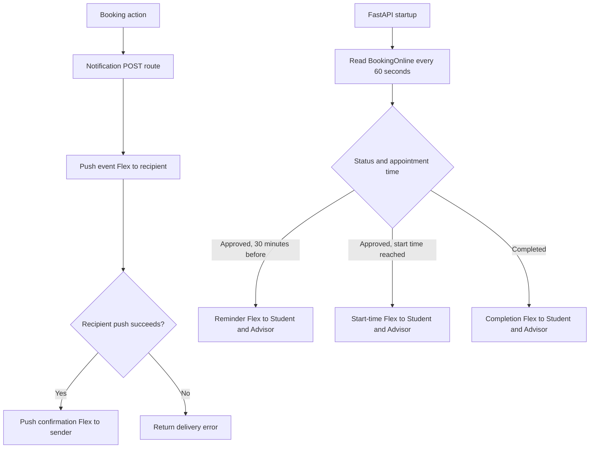

# LINE Chatbot — Research Advisor

FastAPI service สำหรับ LINE chatbot แบบ RAG, รับ PDF เพื่อค้นหาข้อมูลอาจารย์ และส่ง LINE Flex notifications สำหรับการจองนัดหมาย

## ภาพรวมระบบ

```text
PDF upload ──▶ PyMuPDF ──▶ text chunks + embeddings ──▶ MongoDB Atlas
                  │                                      ▲
                  └── image bytes ──▶ Cloudinary ── URL ─┘

LINE message ──▶ /callback ──▶ BAAI/bge-m3 (Hugging Face)
                                      │
                                      ▼
                              MongoDB Vector Search
                                      │
                                      ▼
                                Typhoon API
                                      │
                         text + Cloudinary image URLs
                                      ▼
                                  LINE Push

Booking system ──▶ notification POST routes ──▶ LINE Flex Push API
BORC.BookingOnline ──▶ 60-second reminder loop ──▶ LINE Flex Push API
```

## โครงสร้างโปรเจกต์

```text
app/
├── main.py                       # FastAPI app, router registration, LINE webhook
├── DB/database.py                # MongoDB chatbot connection and PDF deletion
├── routers/
│   ├── extractPDF.py              # PDF upload, extraction, summary and indexing
│   ├── getData.py                 # PDF listing and image redirect
│   └── deleteFile.py              # Delete indexed PDF records
├── services/
│   ├── line_bot.py                # LINE webhook processing and message delivery
│   └── cloudinary.py              # Cloudinary configuration and image upload
├── retriever.py                   # Embedding search and Typhoon response
├── promrt_typhoon.py              # Chat system prompt
└── notification/
    ├── DB/database_noti.py        # BORC notification database
    ├── services/trickgerBooking.py # Scheduled BookingOnline notifications
    ├── helpers/flex.py            # Shared Flex message and push helper
    ├── routers/                   # Login, LINE push and reschedule helpers
    └── users/
        ├── Advisor/               # Booking, cancellation and reschedule
        └── Student/               # Approval, reschedule and URL alerts
Dockerfile
docker-compose.yml
requirements.txt
extractpdf-flow.txt                # Detailed PDF and RAG flow
```

## การเก็บ PDF และรูปภาพ

`POST /upload_pdf` รับ PDF ขนาดไม่เกิน 50 MB และบันทึกเป็นไฟล์ชั่วคราวระหว่างประมวลผล จากนั้นลบไฟล์ชั่วคราวเมื่อทำงานเสร็จ

- ข้อความแต่ละหน้าและ embedding ถูกบันทึกใน MongoDB collection `employee_research_db_V2.employees_profiles`
- รูปต้นฉบับถูกอัปโหลดไปยัง Cloudinary; MongoDB เก็บ `image_url`, คำอธิบาย, metadata และ embedding เท่านั้น
- คำอธิบายรูปปัจจุบันสร้างจากเลขหน้าและข้อความใกล้เคียงใน PDF ไม่ได้วิเคราะห์เนื้อหาจาก pixels
- `GET /image/{file_id}` redirect ไปยัง `image_url` ของเอกสารรูปใน MongoDB และรองรับอ่าน GridFS สำหรับข้อมูลเก่า
- Chatbot ใช้ `image_url` จาก MongoDB ส่งให้ LINE โดยตรง จึงไม่ได้เรียก `/image/{file_id}` ใน flow ปกติ
- `DELETE /delete_file` ลบเอกสาร PDF ใน MongoDB และ GridFS เก่า แต่ยังไม่ได้ลบ asset เดิมออกจาก Cloudinary

## Chat และ RAG

1. LINE ส่ง webhook มาที่ `POST /callback`; ระบบตรวจ `X-Line-Signature`
2. ระบบสร้าง embedding ของคำถามด้วย BAAI/bge-m3 ผ่าน Hugging Face Inference API
3. ค้นเอกสารด้วย MongoDB Vector Search index `vector_index2`
4. ส่งคำถามและบริบทให้ Typhoon API สร้างคำตอบและเลือกรูปจาก URL ที่พบในผลค้นหา
5. ตรวจว่า URL รูปอยู่ในผลค้นหาจริง แล้วส่งข้อความและรูปผ่าน LINE Push API

การสรุป PDF ด้วย Typhoon เกิดตอน upload และส่งกลับใน API response; summary ยังไม่ถูก index เข้า Vector Search

## API routes

| Method | Path | หน้าที่ |
| --- | --- | --- |
| `POST` | `/callback` | LINE webhook สำหรับข้อความและ follow events |
| `GET` | `/health` | Health check |
| `POST` | `/upload_pdf` | อัปโหลดและ index PDF (สูงสุด 50 MB) |
| `GET` | `/files` | รายชื่อ source PDF ที่มีใน MongoDB |
| `GET` | `/image/{file_id}` | Redirect ไป Cloudinary หรืออ่าน GridFS เก่า |
| `DELETE` | `/delete_file?pdf_name=...` | ลบ PDF records จาก MongoDB |
| `POST` | `/NotifyFristLogin/UserLine_id` | ต้อนรับเมื่อผูก LINE; ส่งเมื่อ UserProfile มีสถานะ `Approved` |
| `POST` | `/NotifyQueueAdivsor/BookingStudent` | แจ้งเมื่อมีการจองคิว |
| `POST` | `/NotifyCancelled/CancelBooking` | แจ้งเมื่อนักศึกษายกเลิก |
| `POST` | `/NotifyQueueAdivsor/RecheduleAdvisor` | แจ้งเมื่อนักศึกษาเลื่อนคิว |
| `POST` | `/NotifyQueueStudent/NotifyStudent` | แจ้งผลอนุมัติหรือยกเลิก (`Approved`/`Cancelled`) |
| `POST` | `/NotifyQueueStudent/RecheduleStudent` | แจ้งนักศึกษาเมื่ออาจารย์เลื่อนคิว |
| `POST` | `/NotifyChat/send_url/notification` | ส่งลิงก์นัดหมายให้นักศึกษา |

ไม่มี route หน้า Admin UI ที่ `/` ใน FastAPI app ปัจจุบัน

## Notification flow



### Notification routers: sender and recipient

The sender is the person who initiated the booking action. The recipient gets the main event notification. When delivery succeeds, the sender also gets a confirmation Flex where noted.

| Endpoint | Sender | Main recipient | Confirmation recipient |
| --- | --- | --- | --- |
| `POST /NotifyFristLogin/UserLine_id` | System | `userId` (linked user; only if `Approved`) | — |
| `POST /NotifyQueueAdivsor/BookingStudent` | `StudentId` (student) | `AdvisorId` (advisor) | Student |
| `POST /NotifyCancelled/CancelBooking` | `StudentId` (student) | `AdvisorId` (advisor) | Student |
| `POST /NotifyQueueAdivsor/RecheduleAdvisor` | `StudentId` (student) | `AdvisorId` (advisor) | Student |
| `POST /NotifyQueueStudent/NotifyStudent` | `AdvisorId` (advisor) | `StudentId` (student) | Advisor |
| `POST /NotifyQueueStudent/RecheduleStudent` | `AdvisorId` (advisor) | `StudentId` (student) | Advisor |
| `POST /NotifyChat/send_url/notification` | Booking system | `line_user_id` (student) | — |

For booking-action endpoints, the API sends an event Flex to the recipient first, then a confirmation Flex to the sender if the recipient delivery succeeds. It does not send a separate failure Flex; delivery results are returned under `notification`. Both LINE IDs are required in those request bodies.

Both reschedule endpoints require `StudentName` and `AdvisorName`. The advisor's Flex shows the student's name; the student's Flex shows the advisor's name.

`POST /NotifyQueueStudent/RecheduleStudent` requires `StudentId`, `AdvisorId`, `AdvisorName`, `StudentName`, `ResearchTopic`, `Date`, and `Time`; it does not require `Status`. `POST /NotifyQueueAdivsor/RecheduleAdvisor` also requires `Status: "Rescheduled"`. If LINE rejects the Flex, `/RecheduleStudent` returns HTTP `502` with the delivery details.

### Reminders from `BookingOnline`

On app startup, a background loop reads the existing `BORC.BookingOnline` records every 60 seconds. It uses `userId` for the Student LINE ID and `AdvisorId` for the Advisor LINE ID.

- `Status: "Approved"`: sends a reminder during the 30 minutes before the appointment, then sends another Flex when the appointment start time is reached.
- `Status: "Completed"`: sends a completion Flex.
- `Date` uses `YYYY-MM-DD`; `Time` uses a range such as `13:00-15:00`. The first time is treated as the appointment start.
- `ReminderSent`, `StartNotified`, and `CompletionNotified` are stored on the booking document to prevent repeated notifications.

The background loop checks once per minute, so a time-based notification can be up to about one minute late. No separate MongoDB trigger is required.

## Notification recipients

Booking action endpoints require sender and recipient LINE IDs. A missing or `null` required field is rejected by FastAPI; delivery failures are reported in the HTTP response without sending a separate failure Flex. The automated `BookingOnline` reminders send to whichever LINE IDs are present in each booking record and store a notification flag after the attempt.

## Environment variables

ตั้งค่าใน `.env` ที่ root หรือ environment ของ container:

| Variable | ใช้โดย |
| --- | --- |
| `ACCESS_TOKEN` | LINE Channel Access Token สำหรับส่งข้อความและ Flex notification |
| `CHANNEL_SECRET` | LINE Channel Secret สำหรับตรวจ webhook signature |
| `HUGGINGFACE_TOKEN` | Hugging Face Inference API สำหรับ BAAI/bge-m3 embeddings |
| `Typhoon_api_key` | Typhoon API สำหรับสรุป PDF และสร้างคำตอบแชท |
| `MONGO_URI` | MongoDB chatbot database (`employee_research_db_V2`) |
| `MONGO_URI_BORC` | MongoDB notification database (`BORC`, collections `UserProfile` and `BookingOnline`) |
| `CLOUD_IMAGE` | Cloudinary cloud name |
| `API_KEY` | Cloudinary API key |
| `API_SECRET` | Cloudinary API secret |
| `NGROK_TOKEN` | จำเป็นเมื่อใช้ Compose profile `ngrok` เท่านั้น |
| `Frontend_BORC_URL` | เพิ่ม origin ให้ CORS (ไม่บังคับ) |
| `Backend_BORC_URL` | เพิ่ม origin ให้ CORS (ไม่บังคับ) |
| `ChatBot_URL` | เพิ่ม origin ให้ CORS (ไม่บังคับ) |

`MONGO_URI_BORCL`, `MONGO_URI_LOCAL` และ `NGROK_URL` ไม่ใช่ชื่อตัวแปรที่โค้ดปัจจุบันอ่าน

ตัวอย่าง `.env`:

```env
ACCESS_TOKEN=your_line_channel_access_token
CHANNEL_SECRET=your_line_channel_secret
HUGGINGFACE_TOKEN=your_huggingface_token
Typhoon_api_key=your_typhoon_api_key
MONGO_URI=your_chatbot_mongodb_uri
MONGO_URI_BORC=your_borc_mongodb_uri
CLOUD_IMAGE=your_cloudinary_cloud_name
API_KEY=your_cloudinary_api_key
API_SECRET=your_cloudinary_api_secret
NGROK_TOKEN=your_ngrok_token
```

## การติดตั้งและรัน

Python 3.12:

```powershell
py -3.12 -m venv .venv
.\.venv\Scripts\Activate.ps1
python -m pip install -r requirements.txt
uvicorn app.main:app --host 0.0.0.0 --port 5000 --reload
```

หรือใช้ Docker Compose:

```bash
docker compose up -d
# เลือก tunnel เมื่อจำเป็น โดยเปิดเพียง profile เดียว
docker compose --profile cloudflared up -d
# หรือ
docker compose --profile ngrok up -d
```

ตรวจ app ที่ `http://localhost:5000/health`; ngrok dashboard อยู่ที่ `http://localhost:4040`
